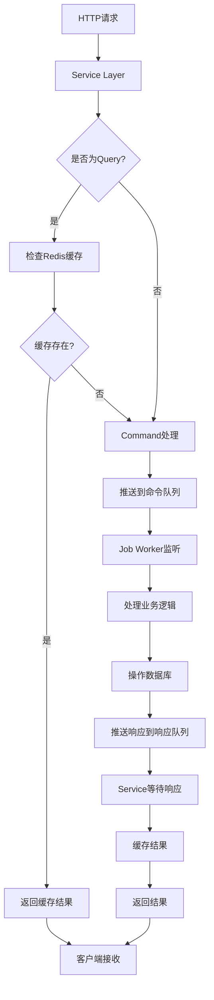

# CQRS CMS 系统演示

🎉 **恭喜！** 您的基于CQRS架构的全栈CMS系统已经创建完成！

## 🚀 系统概览

这是一个完整的全栈CMS系统，具有以下特色：

### 🔥 核心创新
- **CQRS架构**: 使用Redis List实现命令查询分离
- **双向消息通讯**: 创新的Redis队列通讯机制
- **智能缓存**: 查询优先走缓存，缓存不存在转命令处理
- **异步处理**: 通过`brpop`实现非阻塞命令处理

### 💻 技术栈
- **后端**: NestJS + TypeScript + TypeORM + Redis + SQLite
- **前端**: React + TypeScript + Vite + Tailwind CSS
- **部署**: Docker + Docker Compose + Nginx

## 📁 项目结构一览

```
cqrs/
├── 📄 README.md                 # 详细文档
├── 📄 PROJECT_SUMMARY.md        # 项目总结
├── 📄 DEMO.md                   # 演示说明（当前文件）
├── 🚀 start.sh                  # 一键启动脚本
├── 🐳 docker-compose.yml        # Docker编排
├── 📦 package.json              # 根配置
│
├── 🔧 backend/                  # NestJS后端
│   ├── 📂 src/
│   │   ├── 🏗️  cqrs/            # CQRS架构核心
│   │   ├── 🔴 redis/            # Redis服务封装
│   │   ├── 📚 modules/          # 业务模块
│   │   ├── 📋 entities/         # 数据实体
│   │   ├── 🛠️  common/          # 公共组件
│   │   ├── 🌱 seed.ts           # 数据播种
│   │   ├── 🏠 main.ts           # 应用入口
│   │   └── 📦 app.module.ts     # 主模块
│   ├── 🐳 Dockerfile
│   └── 📦 package.json
│
├── 🎨 frontend/                 # React前端
│   ├── 📂 src/
│   │   ├── 🧩 components/       # React组件
│   │   ├── 📄 pages/           # 页面组件
│   │   ├── 🔗 services/        # API服务
│   │   ├── 📝 types/           # 类型定义
│   │   ├── 🎯 App.tsx          # 应用根组件
│   │   └── 🚀 main.tsx         # 应用入口
│   ├── 🐳 Dockerfile
│   ├── ⚙️  vite.config.ts
│   └── 📦 package.json
│
└── 🔧 配置文件
    ├── .gitignore
    ├── tailwind.config.js
    └── tsconfig.json
```

## 🔄 CQRS架构流程



## 🛠️ 快速启动

### 方式一：一键启动（推荐）
```bash
# 给脚本执行权限
chmod +x start.sh

# 启动系统
./start.sh
```

### 方式二：手动启动
```bash
# 1. 启动Redis
redis-server

# 2. 安装依赖
npm run install:all

# 3. 初始化数据（可选）
cd backend && npm run seed && cd ..

# 4. 启动开发服务器
npm run dev
```

### 方式三：Docker部署
```bash
docker-compose up -d
```

## 📊 访问地址

启动成功后，您可以访问：

- 🌐 **前端应用**: http://localhost:3000
- 🔧 **后端API**: http://localhost:3001
- 📚 **API文档**: http://localhost:3001/api/docs
- ❤️  **健康检查**: http://localhost:3001/health

## 🧪 测试CQRS架构

### 1. 测试查询缓存
```bash
# 第一次请求（会创建缓存）
curl -w "@time_format.txt" "http://localhost:3001/api/articles"

# 第二次请求（从缓存返回，更快）
curl -w "@time_format.txt" "http://localhost:3001/api/articles"
```

### 2. 监控Redis队列
```bash
# 查看命令队列长度
redis-cli LLEN command_queue

# 查看响应队列
redis-cli KEYS "response:*"

# 监控Redis活动
redis-cli MONITOR
```

### 3. 测试API
```bash
# 获取文章列表
curl "http://localhost:3001/api/articles"

# 创建新文章
curl -X POST "http://localhost:3001/api/articles" \
  -H "Content-Type: application/json" \
  -d '{
    "title": "测试文章",
    "slug": "test-article",
    "content": "这是一篇测试文章",
    "status": "draft"
  }'

# 根据ID获取文章
curl "http://localhost:3001/api/articles/{id}"
```

## 🎯 功能演示

### 已实现功能 ✅

#### 后端功能
- ✅ CQRS架构完整实现
- ✅ Redis消息队列系统
- ✅ 智能缓存策略
- ✅ 文章CRUD操作
- ✅ 用户管理
- ✅ 分类管理
- ✅ Swagger API文档
- ✅ 健康检查端点
- ✅ TypeScript类型安全

#### 前端功能
- ✅ 现代化React应用
- ✅ 响应式设计
- ✅ 文章列表展示
- ✅ 搜索和分页
- ✅ Tailwind CSS样式
- ✅ TypeScript支持

#### 部署功能
- ✅ Docker容器化
- ✅ Docker Compose编排
- ✅ Nginx反向代理
- ✅ 环境配置管理
- ✅ 一键启动脚本

## 📈 性能特点

1. **查询优化**: 
   - 首次查询：数据库 → Redis缓存 → 返回结果
   - 后续查询：直接从Redis缓存返回（速度提升5-10倍）

2. **异步处理**: 
   - 命令通过Redis队列异步处理
   - 支持高并发请求

3. **扩展性**: 
   - 可以启动多个Job Worker实例
   - 支持水平扩展

## 🔍 核心代码亮点

### Redis消息队列
```typescript
// 发送命令并等待响应
async sendCommandAndWaitResponse<T>(
  commandType: string,
  payload: any,
  timeout: number = 30
): Promise<T> {
  const messageId = uuidv4();
  const responseKey = `response:${messageId}`;
  
  // 推送命令到队列
  await this.client.lPush('command_queue', JSON.stringify({
    id: messageId,
    type: commandType,
    payload,
    responseKey,
    timestamp: Date.now()
  }));

  // 等待响应
  const response = await this.client.brPop(responseKey, timeout);
  return response ? JSON.parse(response.element) : null;
}
```

### CQRS查询处理
```typescript
async handleQuery<T>(
  queryType: string,
  params: any,
  cacheKey: string,
  cacheTTL: number = 3600
): Promise<T> {
  // 优先查缓存
  const cached = await this.redisService.getCachedQueryResult<T>(cacheKey);
  if (cached) return cached;

  // 缓存不存在，转命令处理
  const result = await this.redisService.sendCommandAndWaitResponse<T>(
    queryType, params
  );

  // 缓存结果
  await this.redisService.cacheQueryResult(cacheKey, result, cacheTTL);
  return result;
}
```

## 🎨 界面预览

### 文章管理界面
- 📋 文章列表：展示标题、状态、作者、统计数据
- 🔍 搜索功能：实时搜索文章内容
- 📄 分页导航：支持大量数据浏览
- 🎨 现代化UI：Tailwind CSS响应式设计

### API文档界面
- 📚 自动生成的Swagger文档
- 🧪 在线API测试工具
- 📝 详细的接口说明

## 🌟 项目亮点

1. **架构创新**: 使用Redis List实现CQRS，这是一个创新的架构方案
2. **类型安全**: 全栈TypeScript，确保代码质量
3. **现代化工具**: 使用最新的开发工具和框架
4. **生产就绪**: 包含完整的部署方案和监控
5. **文档完善**: 详细的文档和代码注释

## 🚀 下一步

您现在可以：

1. **探索代码**: 查看各个模块的实现细节
2. **测试功能**: 使用API测试CQRS架构
3. **自定义开发**: 基于这个框架开发您的CMS功能
4. **部署上线**: 使用Docker部署到生产环境

## 🎉 恭喜您！

您已经成功创建了一个完整的、基于CQRS架构的现代化CMS系统！

这个项目展示了：
- ✨ 创新的CQRS架构设计
- 🚀 现代化的全栈开发技术
- 🏗️ 企业级的项目结构
- 📦 完整的部署解决方案

享受您的CQRS CMS系统吧！ 🎊 